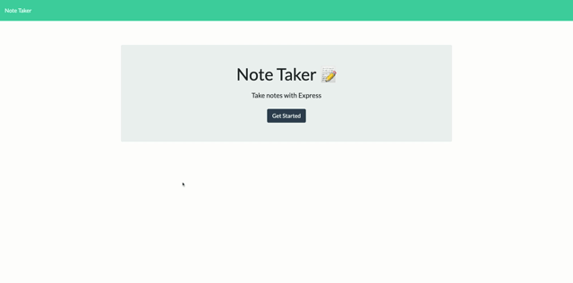

# Note Taker

 [](https://github.com/jdbell123/note_taker/issues)
 [](https://github.com/jdbell123/note_taker/stargazers)
## Table of Contents

* [Reason](#reason)
* [Learnt](#learnt)
* [Take-Aways](#Take-Aways)
* [Installation](#installation)
* [Usage](#usage)
* [Credits](#credits)
* [License](#license)
* [Links](#links)

***

## Reason

The reason for this assignment this week was to continue to learn express.js logic and be introduced to deploying an app to Heroku. We were given the following User Story and Acceptance Criteria:

```
AS A small business owner
I WANT to be able to write and save notes
SO THAT I can organize my thoughts and keep track of tasks I need to complete
```

```
GIVEN a note-taking application
WHEN I open the Note Taker
THEN I am presented with a landing page with a link to a notes page
WHEN I click on the link to the notes page
THEN I am presented with a page with existing notes listed in the left-hand column, plus empty fields to enter a new note title and the note’s text in the right-hand column
WHEN I enter a new note title and the note’s text
THEN a Save icon appears in the navigation at the top of the page
WHEN I click on the Save icon
THEN the new note I have entered is saved and appears in the left-hand column with the other existing notes
WHEN I click on an existing note in the list in the left-hand column
THEN that note appears in the right-hand column
WHEN I click on the Write icon in the navigation at the top of the page
THEN I am presented with empty fields to enter a new note title and the note’s text in the right-hand column
```

---

## Learnt

Working on this project I have learnt about the following things:

    1 - Expanded knowledge on node.js
    2 - Expanded knowledge on express.js
    3 - Expanded knowledge on doing routing
    4 - Expanded knowledge on using Postman
    5 - Expanded knowledge on JavaScript
    6 - Learnt how to deploy Apps to Heroku

---

## Take-Aways

Take your time with the coding and commit often. Also, don't code when you are tired as it will take you twice as long to code it and you will make silly mistakes.

---

## Installation

To install the required libraires for this application use the following command to install the application locally:

```
npm i
```

There is a deployed version of this application. Just navigate to the URL to see the application.

* [Links](#links)

---

## Usage 

To use this application type the following command into your terminal/command prompt (after installing it):

```
npm start
```

Once the local server is running navigate to http://localhost:3030/ to see the app in action.

This is a demo of the finished application:



---

## Credits

As always thanks to my BFF Google for being there in my hours of need. Also, to my fellow class mates for the study groups and hints/tips I received on this project. Last but not least a thank you to the tutor and TAs for the guidance and support they gave on this project. 

---

## License


Licensed under the [MIT](./LICENSE) license.


---

## Links

[GitHub Repo](https://github.com/jdbell123/note_taker)

[Deployed App](https://serene-beach-63964.herokuapp.com/)